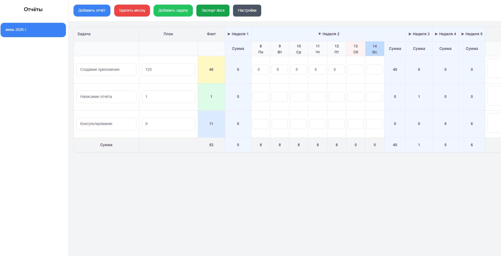
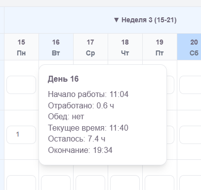
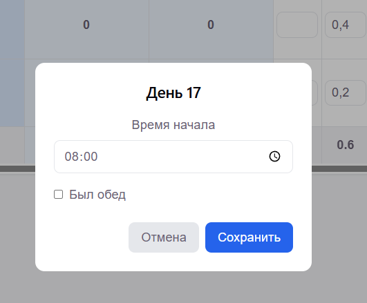
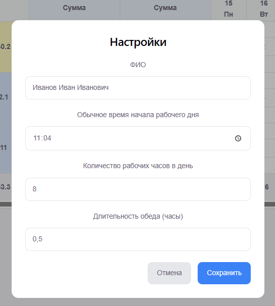

# Hours Tracker

[](https://chromewebstore.google.com/detail/hours-tracker/kbidnnhinbihmpggddnoleippippjejg)
[](https://lavril.github.io/task-hours-extension/)
[](LICENSE)


Удобное расширение для браузера, которое помогает вести учёт трудозатрат по задачам и быстро формировать ежемесячный отчёт по часам.

## Возможности

✅ Учёт часов по задачам в разрезе дней месяца

✅ Плановые и фактические трудозатраты

✅ Автоматический подсчёт итогов по дням, неделям и месяцу

✅ Сворачивание и разворачивание недель

✅ Настройка времени начала рабочего дня

✅ Учёт обеденного перерыва

✅ Подсчёт времени окончания рабочего дня

✅ Подсказки по каждому дню

✅ Выделение текущего дня

✅ Автосохранение данных в браузере

✅ Экспорт отчёта в DOCX

✅ Работа полностью локально без передачи данных на сервер

---

## Установка

### Из Chrome Web Store

Расширение опубликовано в Chrome Web Store:

[Hours Tracker в Chrome Web Store](https://chromewebstore.google.com/detail/hours-tracker/kbidnnhinbihmpggddnoleippippjejg?utm_source=chatgpt.com)

---

### Локальная установка для разработки

```bash
git clone https://github.com/Lavril/task-hours-extension.git

cd task-hours-extension

npm install

npm run dev
```

Для сборки расширения:

```bash
npm run build
```

После сборки каталог `dist` можно загрузить через:

```
chrome://extensions
```

Включите режим разработчика → **Load unpacked** → выберите папку `dist`.

---

## Онлайн демо

Попробовать приложение без установки расширения:

[Демо-версия Hours Tracker](https://lavril.github.io/task-hours-extension/?utm_source=chatgpt.com)

Демо автоматически публикуется через GitHub Actions после обновления основной ветки проекта.

---

## Скриншоты


*Интерфейс*



*Информация о дне (при наведении мышкой на него)*



*Изменение времени начала рабочего дня и флаг обеда (двойное нажатие на день)*



*Настройки*

---

## Технологии

* React
* TypeScript
* Vite
* Tailwind CSS
* Dexie.js
* Zustand
* Docx

---

## Хранение данных

Все данные сохраняются локально в браузере через IndexedDB.

Расширение:

* не требует регистрации;
* не использует внешние серверы;
* не передаёт ваши данные третьим лицам;
* работает полностью офлайн.
